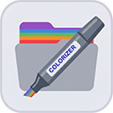

# 🎨 Context Colorizer

  

  <strong>Visually organize and categorize your workspace files and folders inside VS Code using a clean, context-menu driven interface.</strong>

  
  

---

## 📸 Preview

> 💡 **Tip:** Quickly identify key directory pathways at a glance.

---

## ✨ Features Breakdown

| Feature | How it Helps You | Safe for Git? |
| :--- | :--- | :---: |
| **🎨 6 Distinct Colors** | Color-code your environment (Purple, Blue, Green, Orange, Red, Yellow). | Yes |
| **🏷️ 8 Function Symbols** | Tag items with semantic context (Stars, Gears, Locks, Flames, and more). | Yes |
| **🌿 Smart Inheritance** | Color a parent folder, and all children/nested files inherit the visualization. | Yes |
| **🛡️ 100% Sandboxed State** | Saves data locally per workspace without modifying your git status or `settings.json`. | Yes |
| **🔄 Auto-Rename Tracking** | Keep your tags in sync. Automatically tracks moved or renamed directories. | Yes |
| **⌨️ Instantly Undoable** | Press `Cmd+Z` (Mac) or `Ctrl+Z` (Windows/Linux) to instantly revert. | Yes |

---

## 🛠️ How to Use

1. **Right-click** on any folder or file in the explorer tree.
2. Select **`Colorizer: Classify Item...`** at the bottom of the context menu.
3. **Step 1:** Select a color.
4. **Step 2:** Choose a function badge/icon.
5. *To revert a classification, ensure the file explorer is focused and press `Cmd+Z` / `Ctrl+Z`.*

---

## ☕ Support the Project

Let's be honest: hunting for that one specific file inside a monstrous monorepo or a multi-crate Rust workspace is enough to drive anyone insane. **Context Colorizer** was built out of that exact developer desperation.

If this extension saved your sanity, prevented a headache, or simply made your VS Code look 10x cleaner, consider throwing a coin to your local developer! Every coffee helps keep this extension maintained and bug-free.

  

---

## 📄 License

This project is licensed under the MIT License.